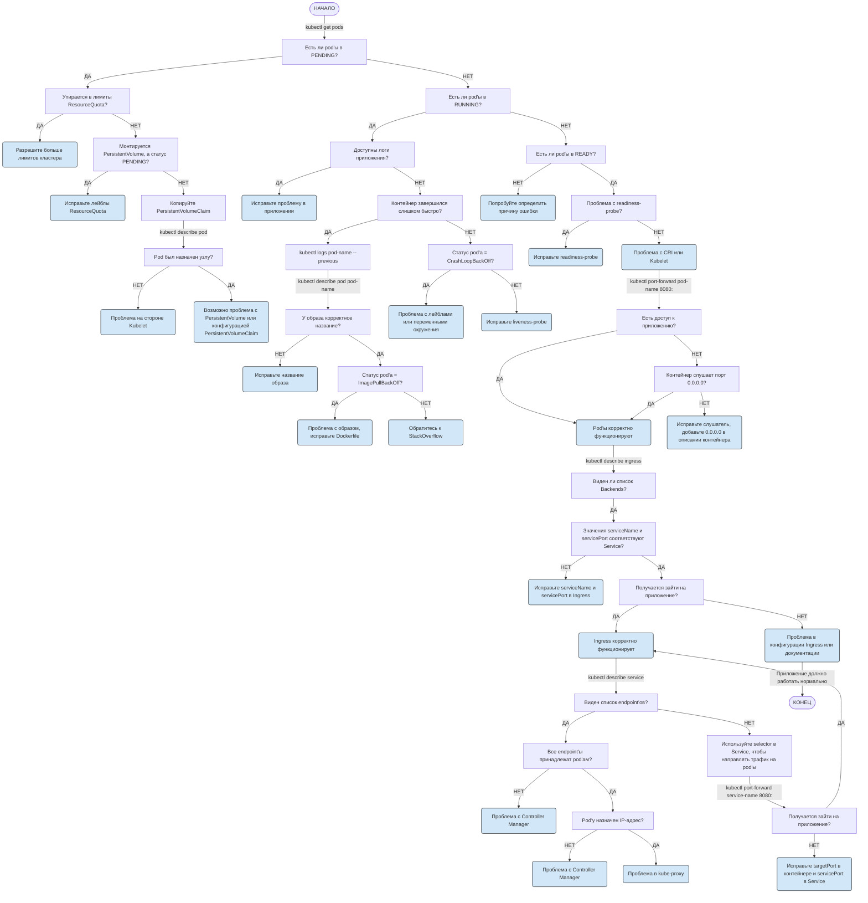

# troubleshooting-k8s
Source - learnk8s.io

```mermaid
flowchart TD
    Start(["НАЧАЛО"])
    %% Проверка состояния pod'ов
    Start -->|"kubectl get pods"| A[Есть ли pod'ы в PENDING?]
    A -->|ДА| B[Упирается в лимиты ResourceQuota?]
    B -->|ДА| C(Разрешите больше лимитов кластера)
    B -->|НЕТ| D[Монтируется PersistentVolume, а статус PENDING?]
    D -->|ДА| E(Исправьте лейблы ResourceQuota)
    D -->|НЕТ| F[Копируйте PersistentVolumeClaim]
    F -->|"kubectl describe pod <pod-name>"| G[Pod был назначен узлу?]
    G -->|НЕТ| H(Проблема на стороне Kubelet)
    G -->|ДА| I(Возможно проблема с PersistentVolume или конфигурацией PersistentVolumeClaim)
    A -->|НЕТ| J[Есть ли pod'ы в RUNNING?]
    J -->|ДА| K[Доступны логи приложения?]
    K -->|ДА| L(Исправьте проблему в приложении)
    K -->|НЕТ| M[Контейнер завершился слишком быстро?]
    M -->|ДА| N["kubectl logs pod-name --previous"]
    N -->|"kubectl describe pod pod-name"| O[У образа корректное название?]
    O -->|НЕТ| P(Исправьте название образа)
    O -->|ДА| Q[Статус pod'а = ImagePullBackOff?]
    Q -->|ДА| R(Проблема с образом, исправьте Dockerfile)
    Q -->|НЕТ| S(Обратитесь к StackOverflow)
    M -->|НЕТ| T[Статус pod'а = CrashLoopBackOff?]
    T -->|ДА| U(Проблема с лейблами или переменными окружения)
    T -->|НЕТ| V(Исправьте liveness-probe)
    %% Проверка pod'ов в состоянии READY
    J -->|НЕТ| W[Есть ли pod'ы в READY?]
    W -->|НЕТ| X(Попробуйте определить причину ошибки)
    W -->|ДА| Z[Проблема с readiness-probe?]
    Z -->|ДА| AA(Исправьте readiness-probe)
    Z -->|НЕТ| AB(Проблема с CRI или Kubelet)
    %% Проверка доступа к приложению
    AB -->|"kubectl port-forward pod-name 8080:<pod-port>"| AC[Есть доступ к приложению?]
    AC -->|ДА| AD(Pod'ы корректно функционируют)
    AC -->|НЕТ| AE[Контейнер слушает порт 0.0.0.0?]
    AE -->|НЕТ| AF(Исправьте слушатель, добавьте 0.0.0.0 в описании контейнера)
    AE -->|ДА| AD
    %% Проверка Ingress
    AD -->|"kubectl describe ingress <ingress-name>"| AG[Виден ли список Backends?]
    AG -->|ДА| AH[Значения serviceName и servicePort соответствуют Service?]
    AH -->|НЕТ| AI(Исправьте serviceName и servicePort в Ingress)
    AH -->|ДА| AJ[Получается зайти на приложение?]
    AJ -->|ДА| AK(Ingress корректно функционирует)
    AJ -->|НЕТ| AL(Проблема в конфигурации Ingress или документации)
    %% Проверка Service
    AK -->|"kubectl describe service <service-name>"| AM[Виден список endpoint'ов?]
    AM -->|ДА| AN[Все endpoint'ы принадлежат pod'ам?]
    AN -->|НЕТ| AO(Проблема с Controller Manager)
    AN -->|ДА| AP[Pod'у назначен IP-адрес?]
    AP -->|НЕТ| AQ(Проблема с Controller Manager)
    AP -->|ДА| AR(Проблема в kube-proxy)
    AM -->|НЕТ| AS[Используйте selector в Service, чтобы направлять трафик на pod'ы]
    AS -->|"kubectl port-forward service-name 8080:<service-port>"| AT[Получается зайти на приложение?]
    AT -->|НЕТ| AU(Исправьте targetPort в контейнере и servicePort в Service)
    AT -->|ДА| AK
    %% Завершение
    AL -->|"Приложение должно работать нормально"| End(["КОНЕЦ"])
    classDef blueFill fill:#d2e7f7,stroke:#000000,stroke-width:1px;
    class C,E,H,I,L,P,R,S,U,V,X,Y,AA,AB,AD,AF,AI,AK,AL,AO,AQ,AR,AU blueFill;
```
